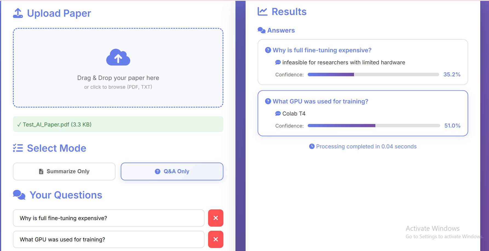
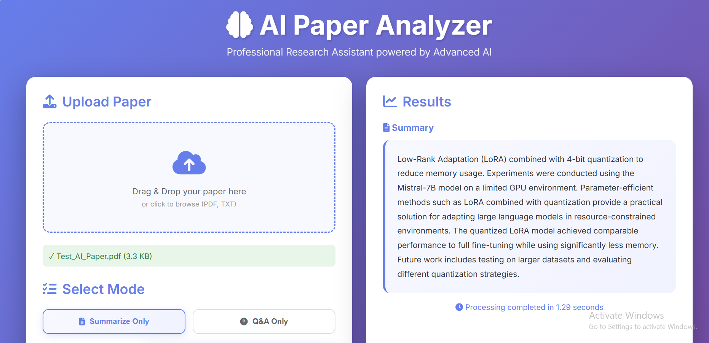

# PaperMind - AI Research Paper Analyzer

A production-ready AI system for intelligent research paper summarization and question answering, built with fine-tuned transformer models and a modern web interface.

## Overview

PaperMind helps researchers quickly understand and extract information from academic papers. The system uses fine-tuned DistilBART for abstractive summarization and DistilBERT for extractive question answering, trained on academic literature.

---

## 📸 Application Preview

### 🔎 Q&A Interface


### 📝 Paper Summarization Interface


---


## Key Features

- **Intelligent Summarization**: Generate accurate, concise summaries of research papers using fine-tuned DistilBART
- **Question Answering System**: Ask specific questions about paper content with confidence scoring
- **Dual Operating Modes**: Choose between summarization-only or Q&A-only workflows
- **Modern Web Interface**: Clean, responsive UI with drag-and-drop file upload
- **RESTful API**: Complete API with OpenAPI documentation for integration
- **Efficient Fine-tuning**: LoRA-based parameter-efficient training on academic papers
- **Multi-format Support**: Process both PDF and TXT documents

## Technical Stack

### Backend
- **Framework**: FastAPI (Python 3.10+)
- **ML Libraries**: PyTorch, HuggingFace Transformers, PEFT
- **Models**: DistilBART-CNN (summarization), DistilBERT-SQuAD (Q&A)
- **Training**: LoRA fine-tuning for efficient adaptation

### Frontend
- **Interface**: Vanilla JavaScript, HTML5, CSS3
- **Design**: Responsive gradient-based UI
- **API Integration**: Fetch API for async requests

### Deployment
- **Server**: Uvicorn ASGI server
- **Tunneling**: Ngrok for public access
- **Environment**: Kaggle notebooks with GPU support

## Architecture
```
User Interface (HTML/CSS/JS)
        |
        v
FastAPI Backend
        |
        v
Inference Layer
        |
        v
Fine-tuned Models (LoRA)
    |           |
    v           v
DistilBART  DistilBERT
(Summary)     (Q&A)
```

## Project Structure
```
PaperMind/
├── src/
│   ├── utils.py              # Helper functions and utilities
│   ├── data_preparation.py   # Dataset loading and preprocessing
│   ├── model_training.py     # Fine-tuning pipeline with LoRA
│   ├── inference.py          # Model inference and testing
│   └── deployment_ui.py      # FastAPI backend and routes
├── static/
│   └── index.html           # Frontend web interface
├── models/                  # Trained model checkpoints
├── data/
│   └── datasets/           # Processed training data
├── config.yaml             # Configuration parameters
├── requirements.txt        # Python dependencies
└── README.md
```

## Installation and Setup

### Prerequisites
- Python 3.10 or higher
- CUDA-compatible GPU (recommended for training)
- 8GB+ RAM

### Local Installation

1. Clone the repository:
```bash
git clone https://github.com/rahaffayez/PaperMind.git
cd PaperMind
```

2. Create and activate virtual environment:
```bash
python -m venv venv
source venv/bin/activate  # On Windows: venv\\Scripts\\activate
```

3. Install dependencies:
```bash
pip install -r requirements.txt
```

4. Run the application:
```bash
python src/deployment_ui.py
```

5. Access the interface:
```
http://localhost:8000
```


## Model Training

### Data Preparation
```bash
python src/data_preparation.py
```

This script:
- Loads arXiv dataset or creates sample data
- Preprocesses papers for summarization tasks
- Generates question-answer pairs
- Splits data into train/validation sets

### Training Process
```bash
python src/model_training.py
```

Training specifications:
- **Summarization Model**: 3 epochs, ~30-45 minutes on GPU T4
- **Q&A Model**: 2 epochs, ~20-30 minutes on GPU T4
- **Optimization**: LoRA with rank 16, alpha 32
- **Batch Processing**: Gradient accumulation for memory efficiency


## Usage Examples

### Web Interface

1. Upload a research paper (PDF or TXT)
2. Select mode (Summarize or Q&A)
3. For Q&A mode: Enter questions
4. Click Process
5. View results with confidence scores


## Technical Details

### Fine-tuning Approach
- Method: Low-Rank Adaptation (LoRA)
- Target modules: Query and value projection layers
- Rank: 16
- Alpha: 32
- Training precision: FP16 mixed precision

### Data Processing
- Tokenization: Subword tokenization with model-specific tokenizers
- Maximum input length: 1024 tokens
- Maximum output length: 256 tokens
- Chunking: Overlapping windows for long documents

## Acknowledgments

- HuggingFace Transformers library
- PEFT library for efficient fine-tuning
- arXiv dataset for training data
- FastAPI framework


